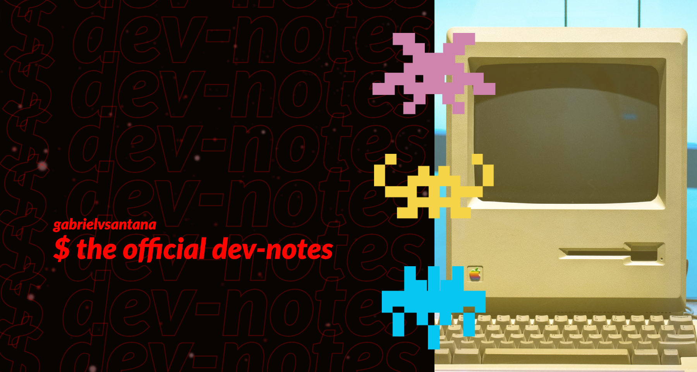

# $ dev-notes



<br/>

# Table of Contents

1. [Disclaimer](#disclaimer)
    - 1.1. [Long Version](#long-version)
    - 1.2. [TLDR Version](#tldr-version)
    - 1.3. [References and Tools](#references-and-tools)
2. [General Topics](#general-topics)
3. [Link To Other Resources](#link-to-other-resources)
4. [References](#references)

<br/>

# Disclaimer

### Long Version

Greetings and welcome to my repository for personal development notes. This repository has been created to compile and organize all my annotations from my career and academic studies. It serves as a comprehensive knowledge map that encompasses my daily work experiences, coursework, and various other subjects of interest.

The goal is to group the key concepts in a way that gives you a solid base to dive into official docs or other resources on your own.

The content in this repository is derived from courses and articles I have read, and I make use of AI to simplify the explanations and give cohesion to the notes. Additionally, I have included sections that provide quick guides and other useful information. Every effort will be made to provide relevant references and citations.

Please keep in mind that this content is constantly evolving and being updated. I am aware that there is much more to learn, and I do not claim that this material is complete. If you encounter any information that is inaccurate or outdated, do not hesitate to contact me. I hope you find this material valuable in some way. Thank you for taking the time to read through my repository.


### TLDR Version

This is a repository for organizing personal development notes, covering daily work, coursework, and other subjects. Key concepts are grouped to provide a solid foundation for further exploration.

Content is derived from courses and articles, and simplified with AI. Quick guides and relevant references are also included.

The material is a work in progress and subject to change, please feel free to contact me for any inaccurate or outdated information.


## References and Tools

This section provides a list of sources that have contributed significantly to my knowledge and the tools that have aided in its construction. While some specific resources and tools are mentioned, it is not an exhaustive list. 

A variety of tools were utilized in the creation of this content, including but not limited to:

- Udemy Courses
- Coursera Courses
- Medium Articles
- Official Documentation of Tools 
- Books
- Grammarly
- ChatGPT

***Note**: The listed items are not presented in any particular order or preference.*

<br/>

# General Topics

In alphabetical order:

1. Auth
1. AWS
1. Data Structures & Algorithms
1. Design Patterns
1. Dev Productivity
1. Docker
1. CI/CD
1. [Git Workflow](https://github.com/gabrielvsantana/git-notes)
1. GraphQL
1. JavaScript
1. Node
1. [Regex](https://github.com/gabrielvsantana/regex-notes)
1. REST
1. S[QL and PostgreSQL](https://github.com/gabrielvsantana/sql-notes)
1. Tests
1. TypeScript

<br/>

# Link To Other Resources

Use this piece of text in other repositories:

```
# For More Dev Notes

This is just one piece of my open personal notes collection, where I'm mapping out all my knowledge. If you're keen on checking out other topics, give this a click: ***[official dev-notes](https://github.com/gabrielvsantana/dev-notes)***
```

<br/>

# References

The image was created using [Adobe Express](https://express.adobe.com/) free templates.
